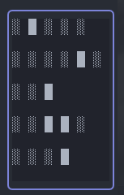

# nvim-binary-clock

This Neovim plugin displays a binary clock in a floating window.


```lua
use "4DRIAN0RTIZ/binaryclock.nvim"
```

## Configuration

This is a default configuration

```lua
require('binary_clock').setup({
  show = true,
  show_date = false,
  sunday_start_week = false,
  symbols = { on = "█", off = "░" }
})
```

## How's read it?

In this binary clock, each column represents a binary digit (bit), where the rightmost column equals 1, and each subsequent column increases its value by powers of 2 (e.g., 1, 2, 4, 8, etc). The time is represented by the sum of the values of the bits that are turned on. Here's an example:

```
8 4 2 1 <- Column values
0 1 0 1 <- Binary representation
```

In this example, the binary 0101 represents the decimal number 5 (4 + 1).

The binary clock has five columns:

1. Hours: Represents the 24 hours of the day in a 5-bits binary number.
2. Minutes: Represents the 60 minutes of the hour in a 6-bits binary number.
3. Day of the week: Represents the 7 days of the week in a 3-bits binary number. Default is Monday(1) to Sunday(7).
4. Day of the month: Represents the 31 days of the month in a 5-bits binary number.
5. Month: Represents the 12 months of the year in a 4-bits binary number.



The image above shows the binary clock with the date enabled. The binary representation:

```
0 0 1 0 0 0 -> 8
0 0 0 0 1 0 -> 2
0 0 0 0 0 1 -> 1
0 0 0 1 1 0 -> 6
0 0 0 0 0 1 -> 1
```

So, the time is 0**8**:0**2**, the day of the week is Monday(**1**), the day of the month is **6** and the month is **1**.

Which means that the date is Monday, 6th of January and the time is 08:02.
